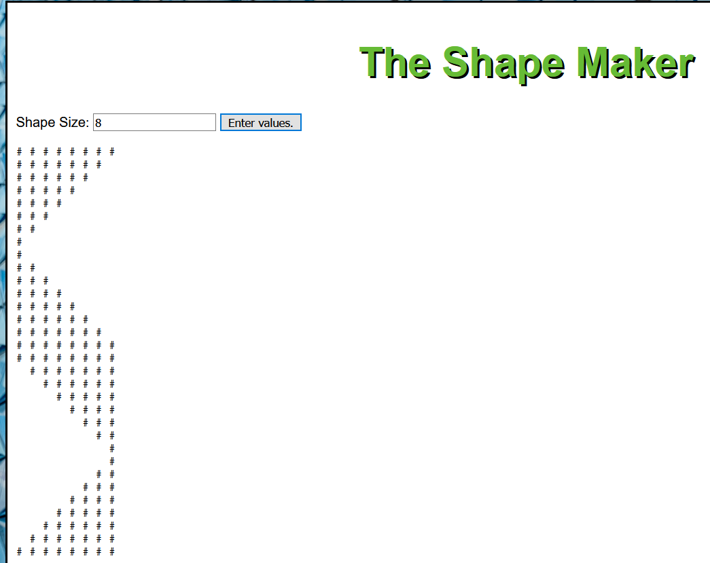

# ShapeMaker

## JavaScript app used to make a diamond symbol of #

JavaScript app creates a shape of symbols based on the # character.  The size of the diamond shape is based on the user's input.  Input validation used on user's input, and loop logic used to build the program.

